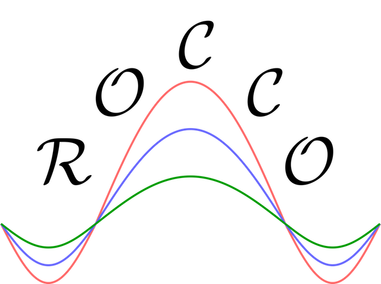
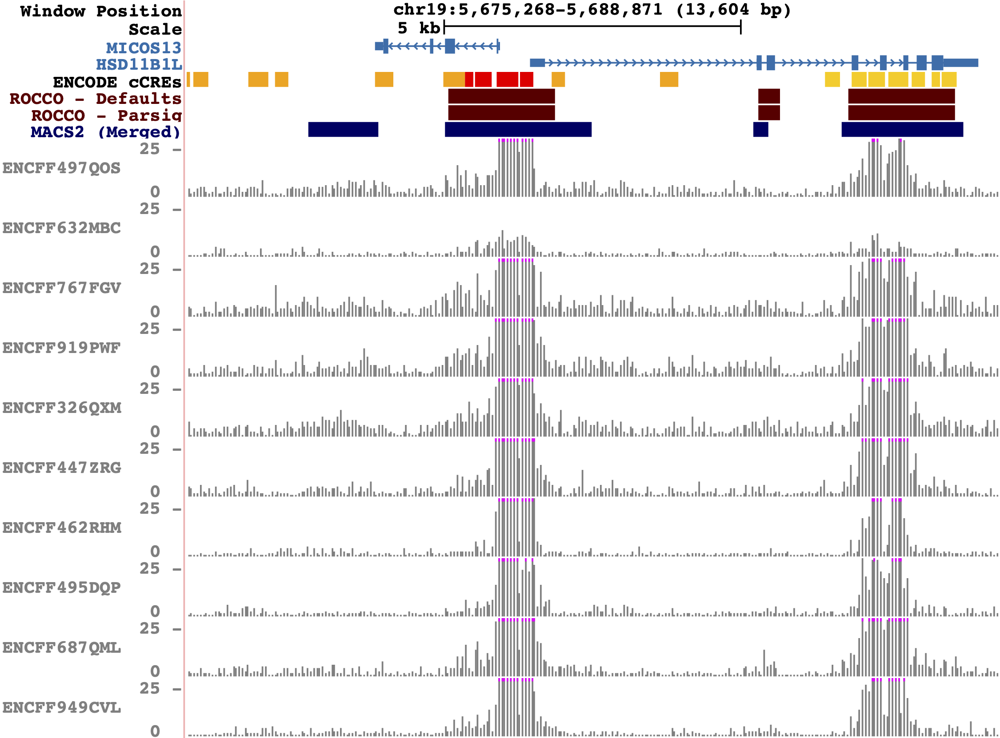

# ROCCO: [R]obust [O]pen [C]hromatin Detection via [C]onvex [O]ptimization

<p align="center">

</p>

## What

ROCCO is an efficient algorithm for detection of "consensus peaks" in large datasets with multiple HTS data samples (namely, ATAC-seq), where an enrichment in read counts/densities is observed in a nontrivial subset of samples.

### Example Behavior

In the image below, ROCCO is run on a set of heterogeneous ATAC-seq samples (lymphoblast) from independent donors (ENCODE). The samples' read density tracks are colored gray.

* ROCCO consensus peaks (default parameters) are shown in blue
* MACS2 (pooled, `q=.01`) consensus peaks are shown in red.
* ENCODE cCREs are included as a rough reference of potentially active regions, but note that these regions are not specific to the data samples used in this analysis, nor are they derived from the same cell type or assay.

<p align="center">

</p>

#### Additional Examples

* ROCCO offers several alternative features for preprocessing, scoring, and optimization
* [A visual characterization of different settings and their effects](docs/rocco_options.png) is available
* See documentation at <https://nolan-h-hamilton.github.io/ROCCO/> for additional details

## How

ROCCO models consensus peak calling as a constrained optimization problem with an upper-bound on the total proportion of the genome selected as open/accessible and a fragmentation penalty to promote spatial consistency in active regions and sparsity elsewhere.

## Why

ROCCO offers several attractive features:

1. **Consideration of enrichment and spatial characteristics** of open chromatin signals
2. **Scaling to large sample sizes** with an asymptotic time complexity independent of sample size
3. **No required training data** or a heuristically determined set of initial candidate peak regions
4. **No rigid thresholds** on the minimum number/width of supporting samples/replicates
5. **Mathematically tractable model** permitting worst-case analysis of runtime and performance

### Paper/Citation

If using ROCCO in your research, please cite the [original paper](https://doi.org/10.1093/bioinformatics/btad725) in *Bioinformatics* (DOI: `btad725`)

   ```plaintext
    Nolan H Hamilton, Terrence S Furey, ROCCO: a robust method for detection of open chromatin via convex optimization,
    Bioinformatics, Volume 39, Issue 12, December 2023
   ```

### Documentation

For additional details, usage examples, etc. please see ROCCO's documentation: <https://nolan-h-hamilton.github.io/ROCCO/>

### Installation

#### PyPI (`pip`)

   ```shell
   pip install rocco # most recent version
   ```

#### Build from Source

If preferred, ROCCO can easily be built from source:

* Clone or download this repository

  ```shell
  git clone https://github.com/nolan-h-hamilton/ROCCO.git
  cd ROCCO
  python setup.py sdist bdist_wheel
  pip install -e .
  ```

### Input/Output

* *Input*: Samples' BAM alignments or BigWig tracks
  * Note, if BigWig input is used, no preprocessing options can be applied at the alignment level.
* *Output*: BED file of consensus peak regions
