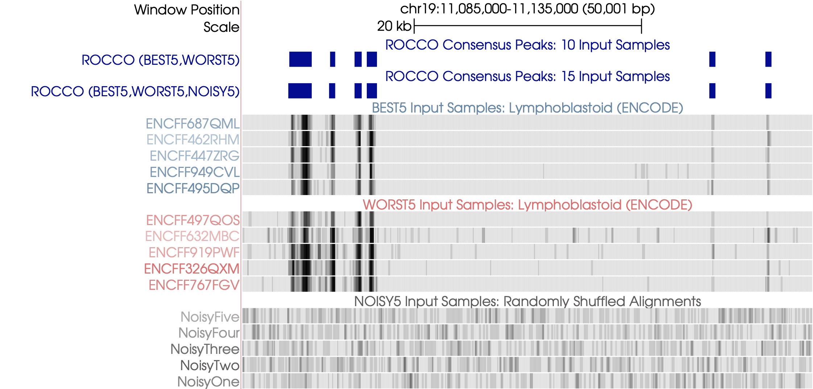

# ROCCO: [R]obust [O]pen [C]hromatin Detection via [C]onvex [O]ptimization

[](https://github.com/nolan-h-hamilton/ROCCO/actions/workflows/docs.yml)
[](https://github.com/nolan-h-hamilton/ROCCO/actions/workflows/tests.yml)


<p align="center">

</p>

## What

ROCCO is an efficient algorithm for detection of "consensus peaks" in large datasets with multiple HTS data samples (namely, ATAC-seq), where an enrichment in read counts/densities is observed in a nontrivial subset of samples.

### Input/Output

* *Input*: Samples' BAM alignments or BigWig tracks
* *Output*: BED file of consensus peak regions (Default format is BED3: `chrom,start,end`)

Note, if BigWig input is used, no preprocessing options can be applied at the alignment level.

## How

ROCCO models consensus peak calling as a constrained optimization problem with an upper-bound on the total proportion of the genome selected as open/accessible and a fragmentation penalty to promote spatial consistency in active regions and sparsity elsewhere.

## Why

ROCCO offers several attractive features:

1. **Consideration of enrichment and spatial characteristics** of open chromatin signals
2. **Scaling to large sample sizes (100+)** with an asymptotic time complexity independent of sample size
3. **No required training data** or a heuristically determined set of initial candidate peak regions
4. **No rigid thresholds** on the minimum number/width of supporting samples/replicates
5. **Mathematically tractable model** permitting worst-case analysis of runtime and performance

## Example Behavior

### Input

* ENCODE lymphoblastoid data (BEST5, WORST5): 10 real ATAC-seq alignments of varying TSS enrichment (SNR-like quality measure for ATAC-seq)
* Synthetic noisy data (NOISY5)

We run twice under two conditions -- *with noisy samples* and *without* for comparison (blue)

  ```shell
  rocco -i *.BEST5.bam *.WORST5.bam -g hg38 -o rocco_output_without_noise.bed
  rocco -i *.BEST5.bam *.WORST5.bam *.NOISY5.bam -g hg38 -o rocco_output_with_noise.bed
  ```

* Note, users may run ROCCO with flag [`--narrowPeak`](https://genome.ucsc.edu/FAQ/FAQformat.html#format12) to generate 10-column output with various statistics for comparison of peaks and supplemental validation independent of ROCCO's optimality criterion.
  * As a byproduct, `--narrowPeak` will likewise produce a 'raw' peak-by-count matrix (one row per peak, one column per sample) that can be used in downstream analyses such as differential accessibility testing.

### Output

Comparing each output file:

* *ROCCO is unaffected by the Noisy5 samples and effectively identifies true signal across multiple samples*
* *ROCCO simultaneously detects both wide and narrow consensus peaks*

<p align="center">

</p>

Additional examples are available [here](docs/downstream.md). For multi-assay, multi-sample consensus peak calling,
users may wish to integrate ROCCO with [Consenrich](https://github.com/nolan-h-hamilton/Consenrich/blob/main/Examples.md).

## Paper/Citation

If using ROCCO in your research, please cite the [original paper](https://doi.org/10.1093/bioinformatics/btad725) in *Bioinformatics* (DOI: `btad725`)

   ```plaintext
    Nolan H Hamilton, Terrence S Furey, ROCCO: a robust method for detection of open chromatin via convex optimization,
    Bioinformatics, Volume 39, Issue 12, December 2023
   ```

## Documentation

For additional details, usage examples, etc. please see ROCCO's documentation: <https://nolan-h-hamilton.github.io/ROCCO/>

## Installation

### PyPI (`pip`)

   ```shell
   python -m pip install rocco --upgrade
   ```

If lacking administrative control, you may need to append `--user` to the above.


### Build from Source

If preferred, ROCCO can easily be built from source:

* Clone or download this repository

  ```shell
  git clone https://github.com/nolan-h-hamilton/ROCCO.git
  cd ROCCO
  python setup.py sdist bdist_wheel
  python -m pip install -e .
  ```
