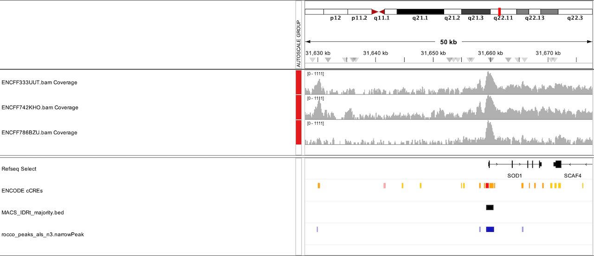

# Downstream Analyses

## Data

| File (Link) | Sex  | Age | Cell Type     | Condition | Reads (f2/F3840) |
|-------------|------|-----|---------------|-----------|---------------|
| [ENCFF333UUT](https://www.encodeproject.org/files/ENCFF333UUT) | Male | 49  | Motor Neuron | ALS       | 144144508 |
| [ENCFF786BZU](https://www.encodeproject.org/files/ENCFF786BZU) | Male | 47  | Motor Neuron | ALS       | 123872478 |
| [ENCFF742KHO](https://www.encodeproject.org/files/ENCFF742KHO) | Male | 55  | Motor Neuron | ALS       | 216811080 |

### ROCCO

For brevity, we will arbitrarily restrict this demonstration to chr16 and chr21.

    ```bash
    rocco -i als_bamfiles/*.bam -g hg38 -o rocco_peaks_als_n3.bed  --narrowPeak --chroms chr16 chr21 --threads 4
    ```

### Consenrich --> ROCCO

One natural downstream task of [Consenrich](https://github.com/nolan-h-hamilton/Consenrich) is consensus peak calling, e.g.,

    ```bash
    consenrich --bam_files als_bamfiles/*.bam -g hg38 --chroms chr16 chr21 --signal_bigwig consenrich_als_n3_signal.bw --eratio consenrich_als_n3_eratio.bw --residuals consenrich_als_n3_residuals.bw -o als_n3.tsv

    rocco -i consenrich_als_n3_signal.bw -g hg38 -o rocco_consenrich_als_males_n3.bed  --narrowPeak --chroms chr16 chr21 --bamlist_txt als_bamfiles/bam_list.txt --threads 4
    ```

### Visualization

Arbitrary region in `chr16`:


