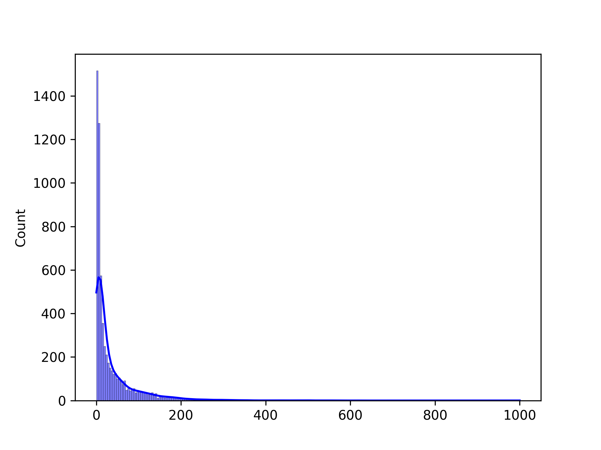

# BED6 ROCCO scores

```python
import rocco
import matplotlib.pyplot as plt
import seaborn as sns

output_file, bam_files, matrix_ = rocco.readtracks.raw_count_matrix(bam_list_file='bam_files.txt',
                                                                    bed_file='test_peaks.bed',
                                                                    output_file='peak_count_matrix.tsv')

peak_scores = rocco.readtracks.score_peaks(bam_files,
                                           'hg38.chrom.sizes',
                                           'test_peaks.bed',
                                           matrix_file='peak_count_matrix.tsv')

sns.histplot(peak_scores, kde=True, color='blue', label='Regular Scale')
plt.savefig('peak_scores_regular.png',dpi=300)
plt.close()
```


